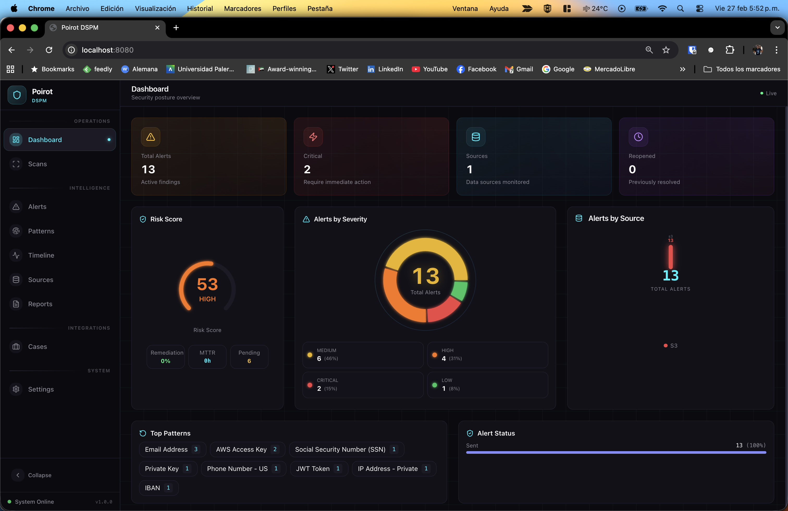
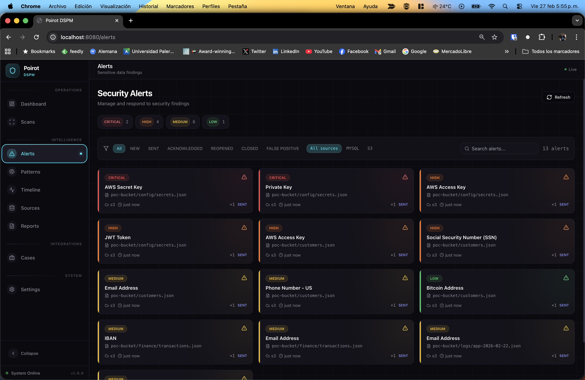
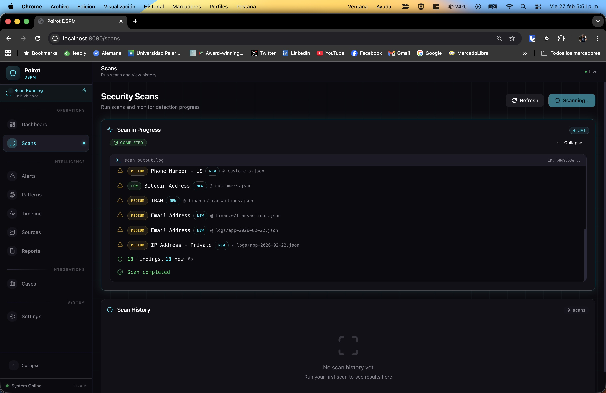
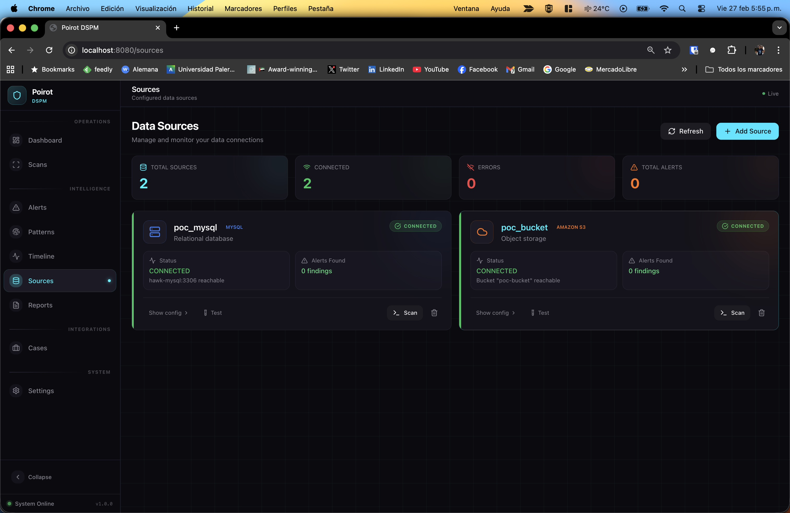
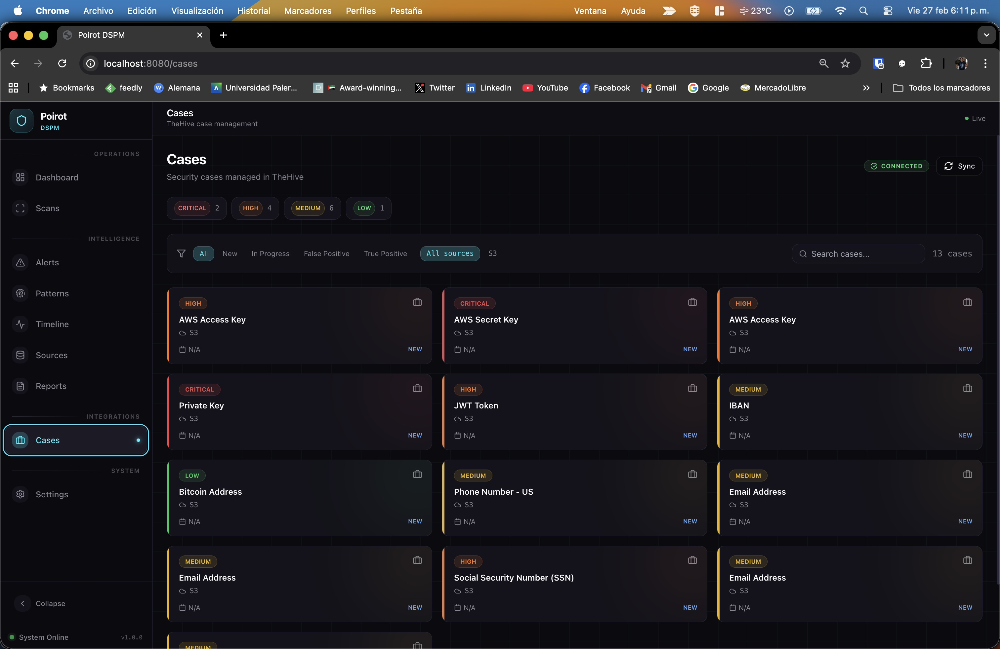
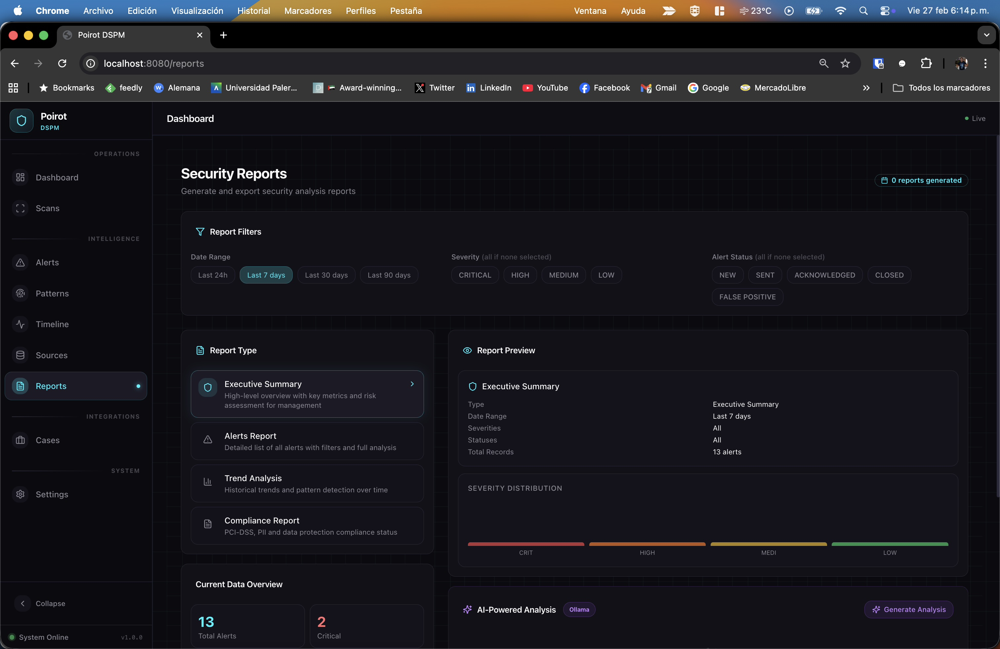
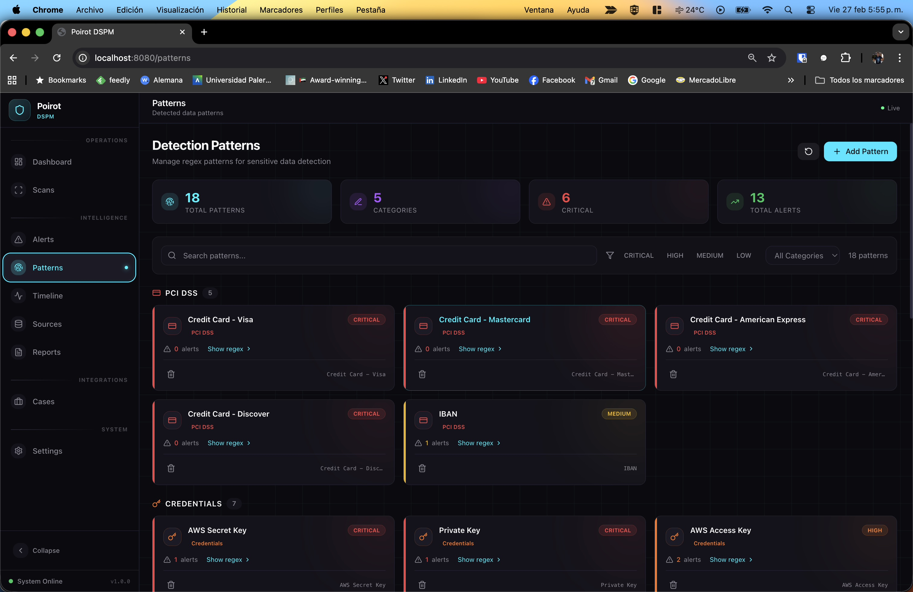
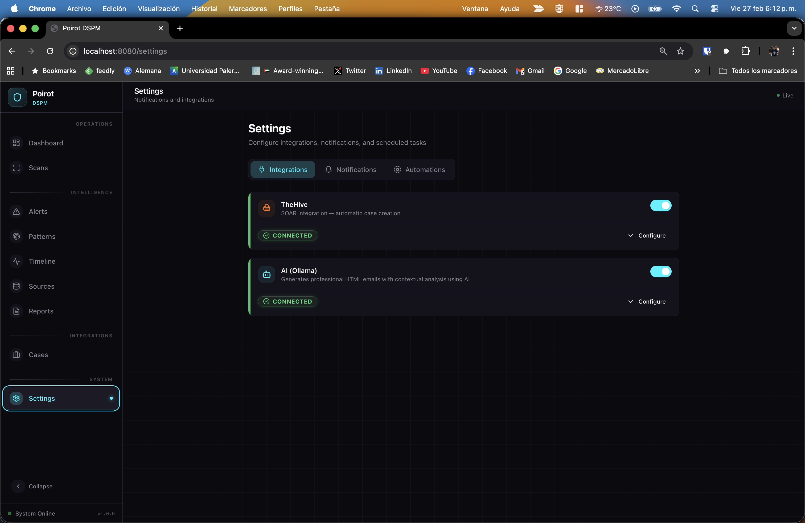
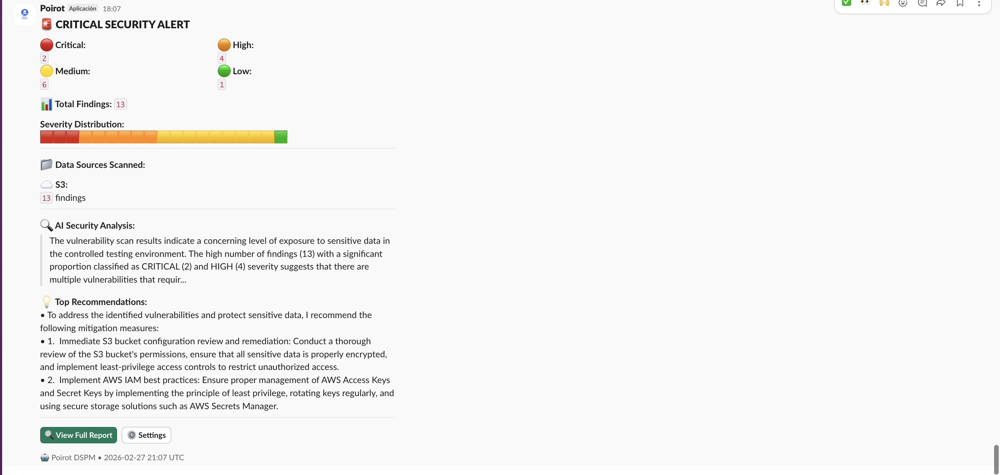
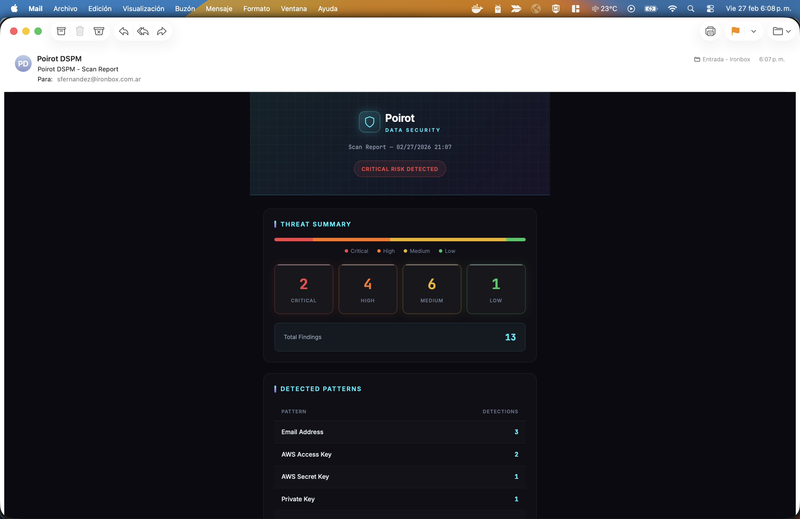

# Poirot DSPM

Automated detection of sensitive data (PII/PCI) across your data sources — MySQL, S3, Kafka, and more.

**Dashboard** | Pattern management | Slack / Email / Teams / Webhook alerts | TheHive integration | AI-powered reports | Built-in docs

---

## Demo

[](https://www.loom.com/share/ae86d0bc3a9240679ba2f8a1a6b358de)

---

## Screenshots

| Dashboard | Alerts |
|-----------|--------|
|  |  |

| Scans | Sources |
|-------|---------|
|  |  |

| Cases (TheHive) | Reports |
|-----------------|---------|
|  |  |

| Patterns | Settings |
|----------|----------|
|  |  |

| Slack Alert | Email Alert |
|-------------|-------------|
|  |  |

---

## Quickstart

```bash
# 1. Clone this repo
git clone https://github.com/safernandez666/poirot-public.git
cd poirot-public

# 2. Configure your environment
cp .env.example .env
# Edit .env with your credentials and data sources

# 3. Start
docker compose up -d

# 4. Open
open http://localhost:8080
```

> Images are pulled automatically from GitHub Container Registry — no build required.

---

## Optional profiles

```bash
# Add TheHive case management
docker compose --profile thehive up -d

# Add local AI for reports (Ollama)
docker compose --profile ollama up -d

# Add demo data (MySQL, S3, Kafka/Redpanda with synthetic PII)
docker compose --profile demo up -d
```

---

## TheHive setup

After starting TheHive for the first time, run the setup script to create an organisation, an API user, and write the API key to your `.env`:

```bash
docker compose --profile thehive up -d   # start TheHive (takes ~2-3 min)

chmod +x scripts/thehive_setup.sh
./scripts/thehive_setup.sh               # creates org + user + API key → .env

docker compose up -d                     # reload dashboard with the new key
```

The script uses the default TheHive admin credentials (`admin@thehive.local` / `secret`). Override them with environment variables if needed:

```bash
THEHIVE_ADMIN_USER=admin@thehive.local \
THEHIVE_ADMIN_PASS=secret \
./scripts/thehive_setup.sh
```

Once done, `THEHIVE_ENABLED=true` and `THEHIVE_API_KEY=<key>` are written to your `.env` automatically.

---

## Configuration

All settings live in `.env`. Copy `.env.example` and fill in your values:

| Section | Variables |
|---|---|
| **Slack** | `SLACK_ENABLED`, `SLACK_WEBHOOK_URL` |
| **Email** | `SMTP_ENABLED`, `SMTP_HOST`, `SMTP_USERNAME`, ... |
| **Teams** | `TEAMS_ENABLED`, `TEAMS_WEBHOOK_URL` |
| **Webhook** | `WEBHOOK_ENABLED`, `WEBHOOK_URL` |
| **TheHive** | `THEHIVE_ENABLED`, `THEHIVE_URL`, `THEHIVE_API_KEY` |
| **Ollama AI** | `OLLAMA_ENABLED`, `OLLAMA_URL`, `OLLAMA_MODEL` |
| **Data sources** | `SOURCE_MYSQL_NAME={"host":"..."}`, `SOURCE_S3_NAME={"bucket":"..."}`, `SOURCE_KAFKA_NAME={"bootstrap_servers":"..."}` |

Data sources can be added and managed from the dashboard UI at `http://localhost:8080/sources`.

For full configuration docs including IAM auth (S3, MSK), SASL/SCRAM, and per-source field reference, open `http://localhost:8080/docs` after starting the stack.

---

## Images

| Image | Registry |
|---|---|
| Scanner | `ghcr.io/safernandez666/poirot-scanner:latest` |
| Dashboard | `ghcr.io/safernandez666/poirot-dashboard:latest` |
