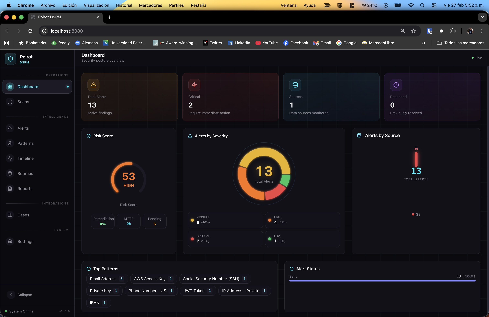
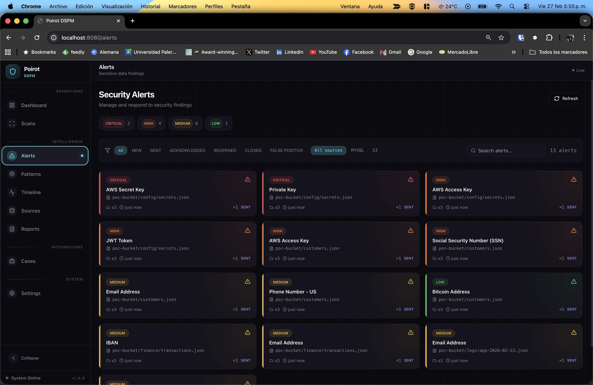
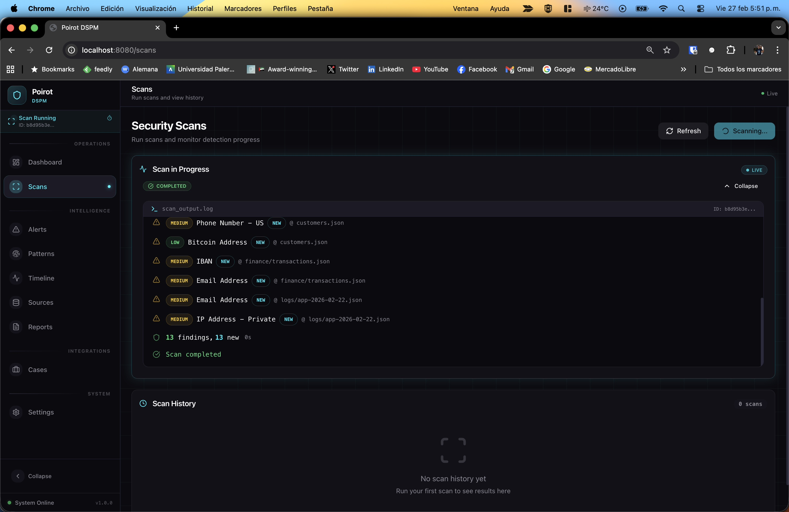
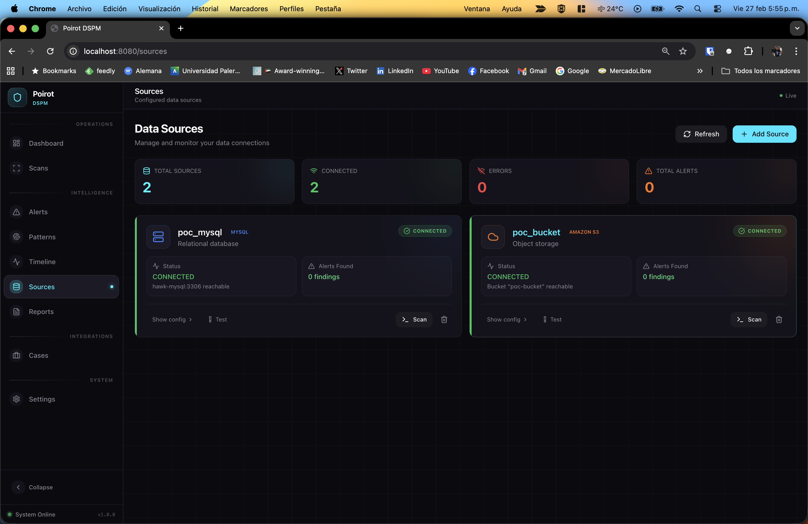
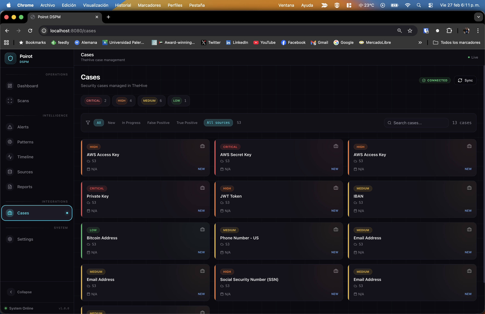
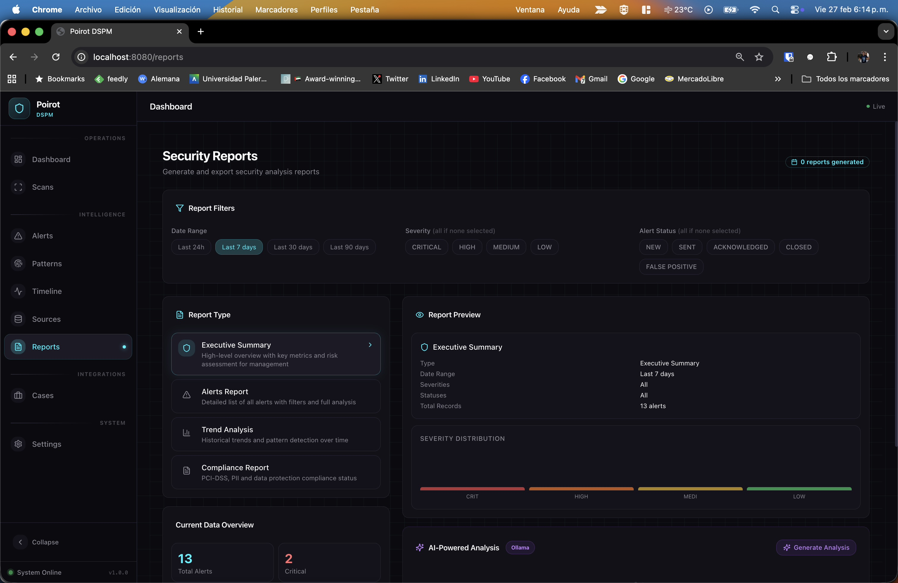
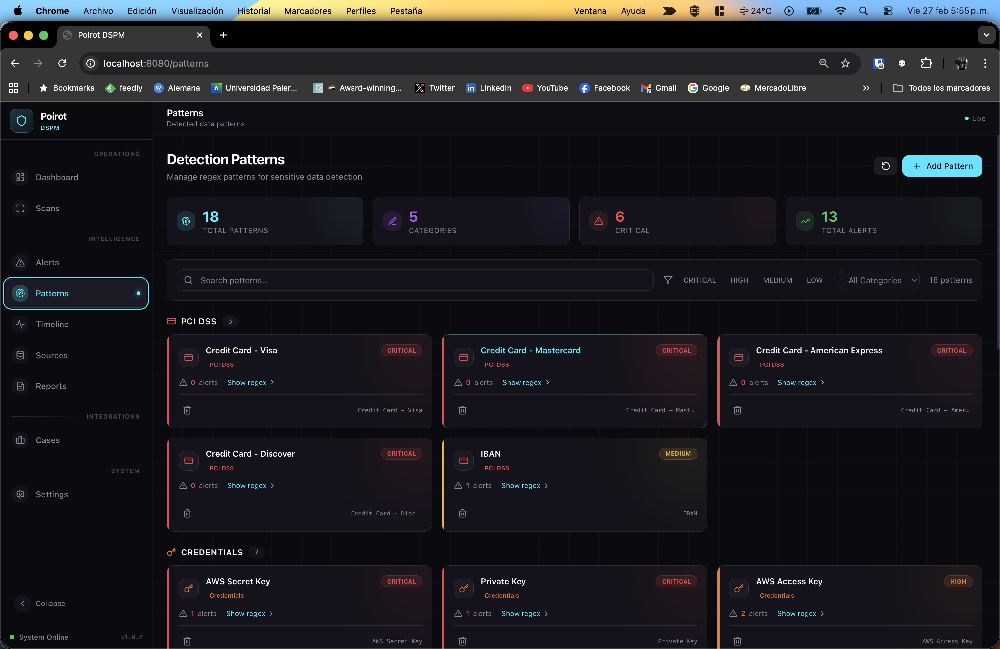
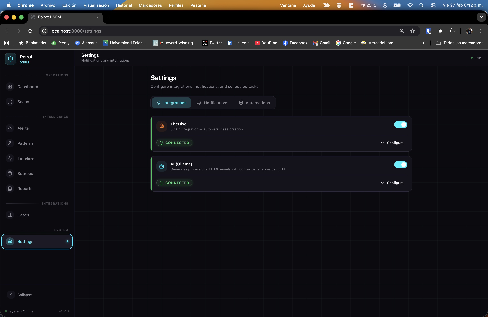
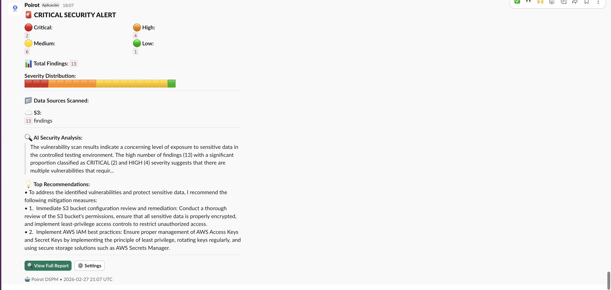
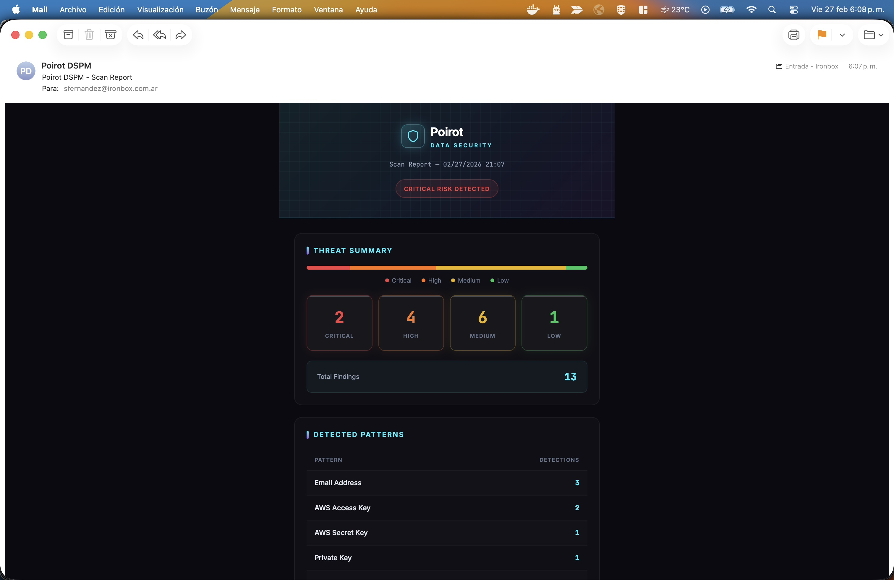

# Poirot DSPM

Automated detection of sensitive data (PII/PCI) across your data sources — MySQL, Oracle, S3, Kafka, and more.

**Dashboard** | Pattern management | Slack / Email / Teams / Webhook alerts | TheHive integration | AI-powered reports | Built-in docs

---

## Screenshots

| Dashboard | Alerts |
|-----------|--------|
|  |  |

| Scans | Sources |
|-------|---------|
|  |  |

| Cases (TheHive) | Reports |
|-----------------|---------|
|  |  |

| Patterns | Settings |
|----------|----------|
|  |  |

| Slack Alert | Email Alert |
|-------------|-------------|
|  |  |

---

## Quickstart

There are multiple ways to run Poirot depending on your use case.

> **Already have Poirot images from a previous install?** Make sure you're running the latest version. Docker won't pull new images if it already has a `latest` tag cached locally. Run this first:
> ```bash
> docker rmi ghcr.io/safernandez666/poirot-scanner:latest ghcr.io/safernandez666/poirot-dashboard:latest 2>/dev/null
> ```
> Then `docker compose up -d` will pull the newest images automatically.

### Option A — Connect your own data sources

Use this when you already have databases, S3 buckets, or Kafka clusters you want to scan.

```bash
git clone https://github.com/safernandez666/poirot-public.git
cd poirot-public

cp .env.example .env
# Edit .env — add your real data sources (MySQL, Oracle, S3, Kafka)

docker compose up -d
open http://localhost:8080
```

This starts **only Poirot** (scanner + dashboard + Keycloak). You configure your data sources in `.env` or from the UI at `/sources`.

> **Remote / Linux server?** If you access Poirot from a different machine (not `localhost`), set these in `config/.env` before starting:
> ```bash
> KEYCLOAK_PUBLIC_URL=http://<YOUR-SERVER-IP>:8180
> KC_HOSTNAME=http://<YOUR-SERVER-IP>:8180
> ```
> Without this, login will fail because the browser can't reach Keycloak at `localhost`.

### Option B — Try the demo (no configuration needed)

Use this to explore Poirot with synthetic data. It starts MySQL, S3 (LocalStack), and Kafka (Redpanda) containers pre-loaded with fake PII (credit cards, SSNs, AWS keys, etc.) ready to scan.

```bash
git clone https://github.com/safernandez666/poirot-public.git
cd poirot-public

cp .env.example .env    # works out of the box, no edits needed

docker compose --profile demo up -d
open http://localhost:8080
```

The demo profile adds:

| Service | Description | Port |
|---------|-------------|------|
| **hawk-mysql** | MySQL 8.0 with 4 tables of synthetic PII (customers, payments, users, servers) | 3306 |
| **localstack** | S3-compatible storage with JSON files containing fake credentials and PII | 4566 |
| **redpanda** | Kafka-compatible broker with 3 topics of sensitive messages | 19092 |
| **demo-setup** | Seeds all the above with ~200 records of synthetic data, then exits | — |

Once everything is up, go to the dashboard and run a scan — you'll see alerts for credit cards, SSNs, AWS keys, and more.

### Option C — Oracle demo

Test the Oracle scanner with a pre-loaded Oracle XE 21c database.

```bash
docker compose --profile oracle up -d
```

This adds:

| Service | Description | Port |
|---------|-------------|------|
| **oracle-xe** | Oracle XE 21c with 4 tables of synthetic PII (customers, payments, employees, servers) | 1521 |
| **oracle-setup** | Seeds 80 rows of credit cards, SSNs, AWS keys, SSH keys, JWTs, then exits | — |

Wait ~2 minutes for Oracle to start, then run a scan from the dashboard. The Oracle source is pre-configured automatically.

> **Note**: Oracle XE requires ~2GB RAM. On Apple Silicon, Docker emulates x86_64.

### Option D — TheHive (case management)

Add TheHive 5 for automatic case creation from scan findings.

```bash
docker compose --profile thehive up -d
```

This adds:

| Service | Description | Port |
|---------|-------------|------|
| **cassandra** | Database backend for TheHive | — |
| **elasticsearch** | Search engine for TheHive | — |
| **thehive** | TheHive 5 case management platform | 9000 |

Configure `THEHIVE_API_KEY` in `.env` after creating an API key in TheHive.

> **Note**: TheHive requires ~3GB RAM (Cassandra + Elasticsearch + TheHive).

### Option E — Ollama AI (report generation)

Add local AI for generating security reports from scan findings.

```bash
docker compose --profile ollama up -d
```

This adds:

| Service | Description | Port |
|---------|-------------|------|
| **ollama** | Local LLM (llama3.2:3b) for AI-powered report generation | 11434 |

> **Note**: First start downloads the model (~2GB). GPU acceleration recommended.

### Combining profiles

Profiles can be combined freely:

```bash
# Demo data + Oracle + TheHive + AI reports
docker compose --profile demo --profile oracle --profile thehive --profile ollama up -d

# Just Oracle + TheHive
docker compose --profile oracle --profile thehive up -d
```

> Images are pulled automatically from GitHub Container Registry — no build required.

---

## Authentication

Poirot uses **Keycloak** as identity provider. It starts automatically with the stack.

| Service | URL | Credentials |
|---------|-----|-------------|
| Dashboard | http://localhost:8080 | Redirects to Keycloak login |
| Keycloak Admin Console | http://localhost:8180 | `admin` / `admin` |

#### Test Users

| User | Password | Role | Permissions |
|------|----------|------|-------------|
| `admin-user` | `Test1234!` | **admin** | Full access — settings, sources, patterns, scans, delete |
| `analyst-user` | `Test1234!` | **analyst** | Run scans, add sources/patterns — no settings or delete |
| `viewer-user` | `Test1234!` | **viewer** | Read-only — dashboard, alerts, timeline, reports |

> Passwords are temporary — Keycloak will prompt a change on first login.

#### Remote Access

If you access Poirot from a different machine (not `localhost`), you **must** set both URLs in your `config/.env` so the browser and Keycloak know the public address:

```bash
KEYCLOAK_PUBLIC_URL=http://<YOUR-SERVER-IP>:8180
KC_HOSTNAME=http://<YOUR-SERVER-IP>:8180
```

Then restart: `docker compose down && docker compose up -d`

Without this, the dashboard will show **"Authentication required but could not connect to the identity provider"** because the browser tries to reach `localhost:8180` on the client machine.

#### API Keys

Admins can create API keys at **Settings > Security** for programmatic access. Each key is scoped to a role (admin, analyst, viewer).

```bash
curl -H "X-API-Key: poirot_abc123..." http://localhost:8080/api/stats
```

#### SSL Mode

Configure Keycloak SSL requirements at **Settings > Security** without editing files or rebuilding:

| Mode | Description |
|------|-------------|
| `none` | No SSL required (development) |
| `external` | SSL for external requests only (recommended for production) |
| `all` | SSL for all requests |

Changes apply immediately to Keycloak and are persisted in `.env` (`KC_SSL_REQUIRED`) for restart survival.

#### Keycloak Details

| Setting | Value |
|---------|-------|
| Realm | `poirot` |
| Dashboard client | `poirot-dashboard` (public, PKCE S256) |
| API client | `poirot-api` (confidential, service account) |
| Roles | `admin`, `analyst`, `viewer` |
| Brute force protection | Enabled (5 failures > 5 min lockout) |

To disable authentication, set `AUTH_ENABLED=false` in `.env`.

---

## What gets started

### `docker compose up -d` (core only)

| Container | Image | Description |
|-----------|-------|-------------|
| `poirot-init` | `ghcr.io/safernandez666/poirot-scanner` | Extracts default config files on first run, then exits |
| `hawk-scanner` | `ghcr.io/safernandez666/poirot-scanner` | The scanning engine |
| `hawk-dashboard` | `ghcr.io/safernandez666/poirot-dashboard` | Web UI + API on port **8080** |
| `keycloak` | `quay.io/keycloak/keycloak:26.1` | Identity provider (login, RBAC, social login) on port **8180** |

### `docker compose --profile demo up -d` (core + demo data)

Everything above, plus MySQL, LocalStack (S3), Redpanda (Kafka), and the demo seeder.

### `docker compose --profile oracle up -d` (core + Oracle)

Everything above, plus Oracle XE 21c with synthetic PII data.

### `docker compose --profile thehive up -d` (core + case management)

Everything above, plus Cassandra, Elasticsearch, and TheHive 5.

### `docker compose --profile ollama up -d` (core + AI)

Everything above, plus Ollama with llama3.2:3b for report generation.

---

## Configuration

All settings live in `.env`. Copy `.env.example` and fill in your values.

### Notification channels

| Channel | Key variables |
|---------|---------------|
| **Slack** | `SLACK_ENABLED`, `SLACK_WEBHOOK_URL` |
| **Email** | `SMTP_ENABLED`, `SMTP_HOST`, `SMTP_USERNAME`, `SMTP_PASSWORD`, `SMTP_TO_ADDRESSES` |
| **Teams** | `TEAMS_ENABLED`, `TEAMS_WEBHOOK_URL` |
| **Webhook** | `WEBHOOK_ENABLED`, `WEBHOOK_URL` |

### Data sources

Data sources are defined in `.env` with the format `SOURCE_{TYPE}_{NAME}={"field":"value",...}`:

```bash
# MySQL
SOURCE_MYSQL_PRODUCTION={"host":"db.internal","port":3306,"user":"scanner","password":"s3cr3t","database":"app_db"}

# Oracle
SOURCE_ORACLE_PROD={"host":"oracle.internal","port":1521,"service_name":"ORCL","user":"scanner","password":"s3cr3t"}

# S3
SOURCE_S3_DATA_LAKE={"access_key":"AKIA...","secret_key":"...","bucket_name":"my-bucket","region":"us-east-1"}

# Kafka
SOURCE_KAFKA_EVENTS={"bootstrap_servers":"kafka:9092","topics":"orders,users","group_id":"poirot-scanner"}
```

Sources can also be added and managed from the dashboard UI at `/sources`.

For full configuration docs including IAM auth (S3, MSK), SASL/SCRAM, and Oracle Thin mode, open `/docs` in the dashboard after starting the stack.

---

## Updating to the latest version

When new images are published, update your deployment:

```bash
# Stop the stack
docker compose down

# Remove old Poirot images to force pulling the latest
docker rmi ghcr.io/safernandez666/poirot-scanner:latest ghcr.io/safernandez666/poirot-dashboard:latest

# Start again (pulls new images automatically)
docker compose up -d
```

Or use the one-liner:

```bash
docker compose down && docker rmi ghcr.io/safernandez666/poirot-scanner:latest ghcr.io/safernandez666/poirot-dashboard:latest 2>/dev/null; docker compose up -d
```

To pin a specific version instead of `latest`:

```bash
POIROT_TAG=<commit-sha> docker compose up -d
```

### Full reset (removes all data)

```bash
docker compose --profile demo --profile oracle --profile thehive --profile ollama down -v --remove-orphans
docker rmi ghcr.io/safernandez666/poirot-scanner:latest ghcr.io/safernandez666/poirot-dashboard:latest 2>/dev/null
```

This removes all containers, volumes (alerts, scan history, Keycloak users), and cached images.

---

## Profiles summary

| Profile | Adds | Extra RAM |
|---------|------|-----------|
| *(none)* | Scanner + Dashboard + Keycloak | ~1 GB |
| `demo` | MySQL, LocalStack (S3), Redpanda (Kafka), demo seeder | +1 GB |
| `oracle` | Oracle XE 21c, oracle seeder | +2 GB |
| `thehive` | Cassandra, Elasticsearch, TheHive 5 | +3 GB |
| `ollama` | Ollama with llama3.2:3b | +2 GB |

---

## Images

| Image | Registry |
|---|---|
| Scanner | `ghcr.io/safernandez666/poirot-scanner:latest` |
| Dashboard | `ghcr.io/safernandez666/poirot-dashboard:latest` |
